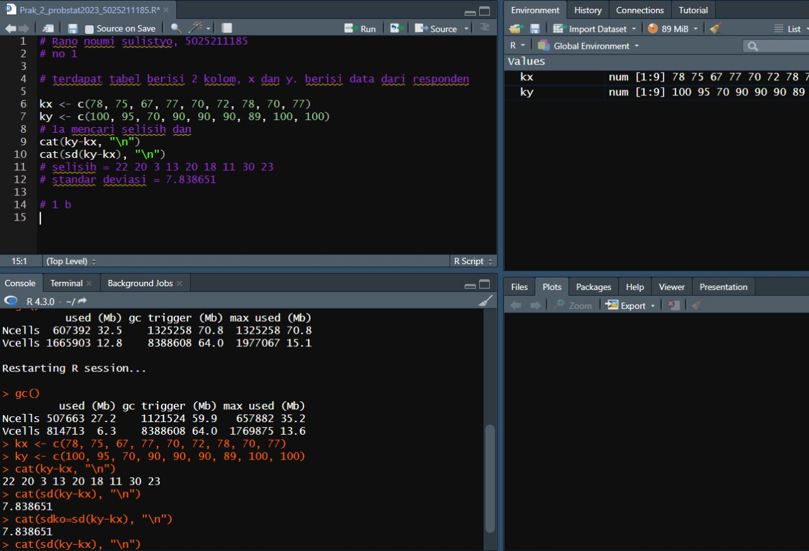
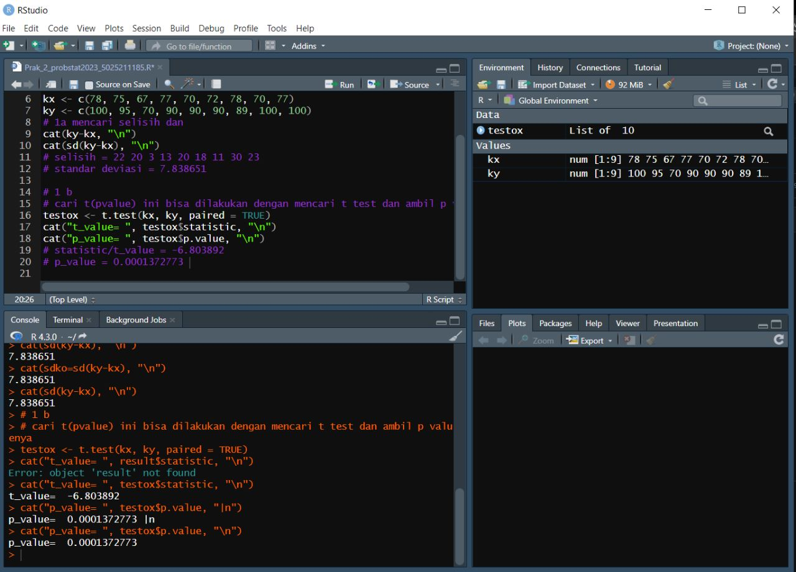
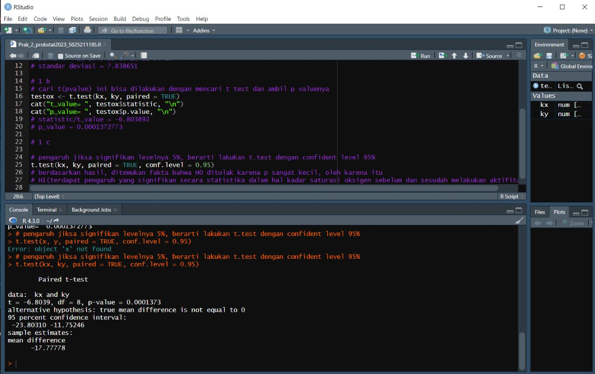
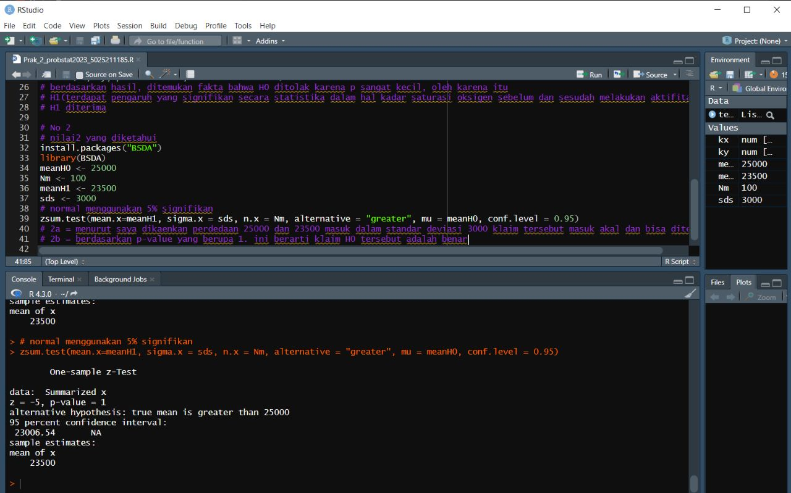
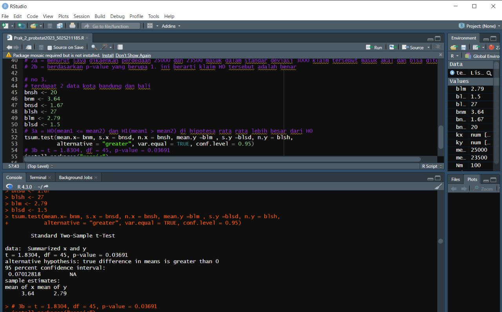
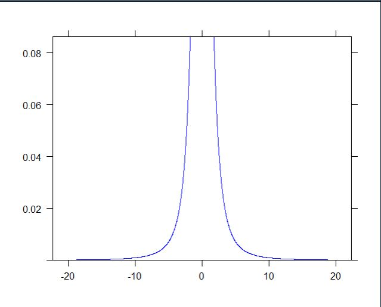
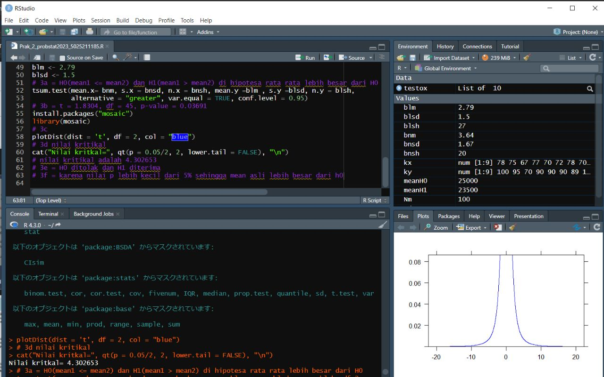
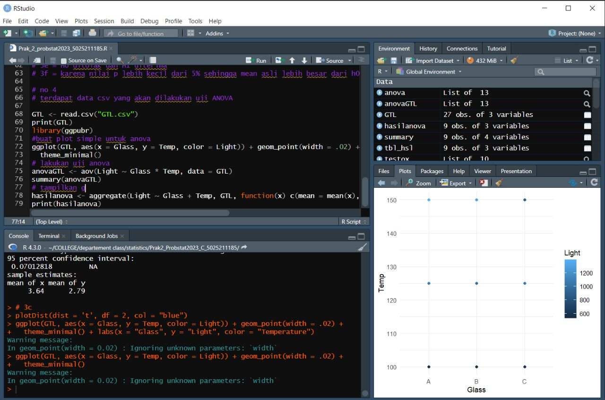
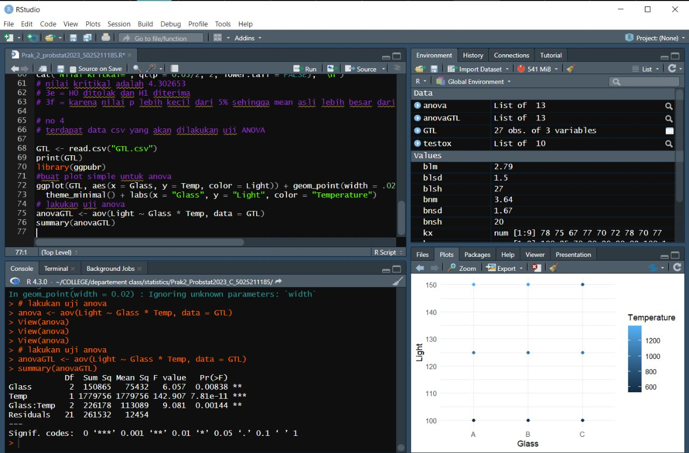
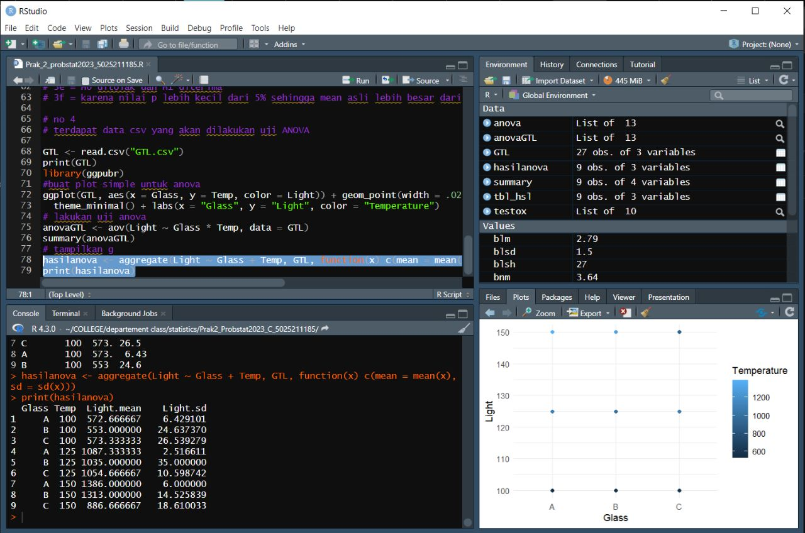

# Prak2_Probstat2023_C_5025211185
Rano Noumi Sulistyo 
5025211185
Probstat C

### No 1
Seorang peneliti melakukan penelitian mengenai pengaruh aktivitas 𝐴 terhadap kadar saturasi oksigen pada manusia. Peneliti tersebut mengambil sampel sebanyak 9 responden. Pertama, sebelum melakukan aktivitas 𝐴, peneliti mencatat kadar saturasi oksigen dari 9 responden tersebut. Kemudian, 9 responden tersebut diminta melakukan aktivitas 𝐴. Setelah 15 menit, peneliti tersebut mencatat kembali kadar saturasi oksigen dari 9 responden tersebut. Berikut data dari 9 responden mengenai kadar saturasi oksigen sebelum dan sesudah melakukan aktivitas.
```
Responden X Y
1 78 100
2 75 95
3 67 70
4 77 90
5 70 90
6 72 90
7 78 89
8 70 100
9 77 100
```
### 1a 
Cari selisih dan standar deviasi
Pertama kita perlu dekalrasi kedau kolom nilai nilai data menggunkan c dan vairable ky dan kx untuk masing masing x dan y. Setelah itu kita kurang y kurangi x untuk mendapatkan selisih. Standar deviasi bisa dicari menggunkan fungsi sd dan memasukkan kx dan ky
**cat(ky-kx, "\n") cat(sd(ky-kx), "\n")**
selisih = 22 20 3 13 20 18 11 30 23
standar deviasi = 7.838651 

### 1b
cari t(pvalue) ini bisa dilakukan dengan mencari t test dan ambil p valuenya 
dalam fungsi t.test kita akan melakukan test yang akan mencari parameter fungsi. p value adalah kemungkinan kasua terjadi
**t.test(kx, ky, paired = TRUE)**
```
data:  kx and ky
t = -6.8039, df = 8, p-value = 0.0001373
alternative hypothesis: true mean difference is not equal to 0
95 percent confidence interval:
 -23.80310 -11.75246
sample estimates:
mean difference 
      -17.77778 
```
statistic/t_value = -6.803892 
p_value = 0.0001372773 

### 1c
pengaruh jika signifikan levelnya 5%, berarti lakukan t.test dengan confident level 95% serta H0 : “tidak ada pengaruh yang signifikan secara statistika dalam hal kadar saturasi oksigen sebelum dan sesudah melakukan aktivitas 𝐴”
**t.test(kx, ky, paired = TRUE, conf.level = 0.95)**
```
	Paired t-test

data:  kx and ky
t = -6.8039, df = 8, p-value = 0.0001373
alternative hypothesis: true mean difference is not equal to 0
95 percent confidence interval:
 -23.80310 -11.75246
sample estimates:
mean difference 
      -17.77778 
```
berdasarkan hasil, ditemukan fakta bahwa H0 ditolak karena p sangat kecil, oleh karena itu
H1(terdapat pengaruh yang signifikan secara statistika dalam hal kadar saturasi oksigen sebelum dan sesudah melakukan aktifitas A)
H1 diterima

## NO 2
Diketahui bahwa mobil dikemudikan rata-rata lebih dari 25.000 kilometer per 
tahun. Untuk menguji klaim ini, 100 pemilik mobil yang dipilih secara acak 
diminta untuk mencatat jarak yang mereka tempuh. Jika sampel acak 
menunjukkan rata-rata 23.500 kilometer dan standar deviasi 3.000 kilometer
(kerjakan menggunakan library seperti referensi pada modul).
**zsum.test(mean.x=meanH1, sigma.x = sds, n.x = Nm, alternative = "greater", mu = meanH0, conf.level = 0.95)**
```
	One-sample z-Test
data:  Summarized x
z = -5, p-value = 1
alternative hypothesis: true mean is greater than 25000
95 percent confidence interval:
 23006.54       NA
sample estimates:
mean of x 
    23500 
```
### 2a = menurut saya dikaenkan perdedaan 25000 dan 23500 masuk dalam standar deviasi 3000 klaim tersebut masuk akal dan bisa diterima
### 2b = berdasarkan p-value yang berupa 1. ini berarti klaim H0 tersebut adalah benar


## NO 3
Diketahui perusahaan memiliki seorang data analyst yang ingin memecahkan
permasalahan pengambilan keputusan dalam perusahaan tersebut. Selanjutnya
didapatkanlah data berikut dari perusahaan saham tersebut.
Nama Kota/Atribut Bandung Bali
Jumlah Saham 20 27
Sampel Mean 3.64 2.79
Sampel Standar Deviasi 1.67 1.
### 3a = H0(mean1 <= mean2) dan H1(mean1 > mean2) di hipotesa rata rata lebih besar dari H0
### 3b
kita menggunakan tsumtest kita bisa menemukain nilai nilai dari data yang akan kita uji dan kita gunakan greater karena H1 nya lebih besar dari H0
**tsum.test(mean.x= bnm, s.x = bnsd, n.x = bnsh, mean.y =blm , s.y =blsd, n.y = blsh, alternative = "greater", var.equal = TRUE, conf.level = 0.95)**
```
	Standard Two-Sample t-Test
data:  Summarized x and y
t = 1.8304, df = 45, p-value = 0.03691
alternative hypothesis: true difference in means is greater than 0
95 percent confidence interval:
 0.07012818         NA
sample estimates:
mean of x mean of y 
     3.64      2.79 
```

### 3c
Lakukan uji statistik (df=2), disini kita akan menggunakan plotdist dengan df = 2 untuk penggambaran

### 3d
kita lalu akan hitung uji kritikal dengan menggunakan fungsi qt. Dikarenakan greater maka kita memastikan lower.tail=false
**cat("Nilai kritkal=", qt(p = 0.05/2, 2, lower.tail = FALSE), "\n")**
**nilai kritikal adalah 4.302653**
### 3e = H0 ditolak dan H1 diterima
### 3f = karena nilai p lebih kecil dari 5% sehingga mean asli lebih besar dari h0


## NO 4
Data yang digunakan merupakan hasil eksperimen yang dilakukan untuk 
mengetahui pengaruh suhu operasi (100˚C, 125˚C dan 150˚C) dan tiga jenis kaca 
pelat muka (A, B dan C) pada keluaran cahaya tabung osiloskop. Percobaan 
dilakukan sebanyak 27 kali dan didapat data sebagai berikut:

Dalam soal ini data ada dalm sebuah file csv beranama GTL sehingga kita perlu baca GTL dan masukkan dalam sebuah variable list
```
GTL <- read.csv("GTL.csv")
print(GTL)
```
### 4a
Kita akan membuat sebuah plot anova sederhana dengan menggunkan ggplot dari library ggpubr. fungsi ini akan mendisplay nilai nilai per kelompok dengan tinggi sebagai Temp dan warna sebagai lightnya. Dia akan membaca secara langsung dari list GTL dan di display
```
ggplot(GTL, aes(x = Glass, y = Temp, color = Light)) + geom_point(width = .02) +
  theme_minimal()
```


### 4b
Kita akan melakukan uji anova menggunkaan fungsi aov. dan di summary
```
anovaGTL <- aov(Light ~ Glass * Temp, data = GTL)
summary(anovaGTL)
```


### 4c
Kita akan buat tabel agregasi anova yang berisi mean dan standar deviasi dar light untuk tiap kasus
```
hasilanova <- aggregate(Light ~ Glass + Temp, GTL, function(x) c(mean = mean(x), sd = sd(x)))
print(hasilanova)
```
